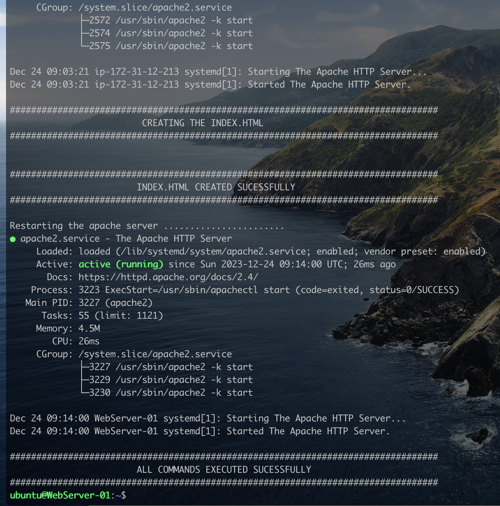
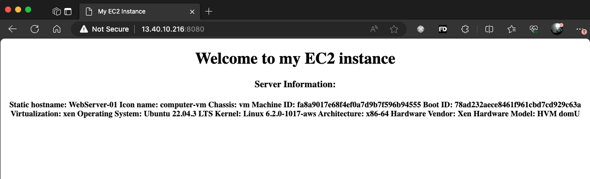
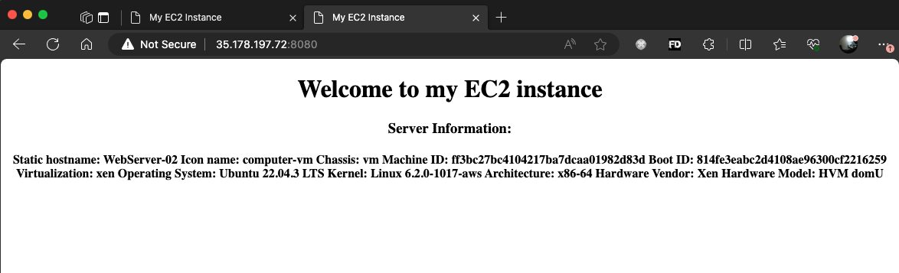
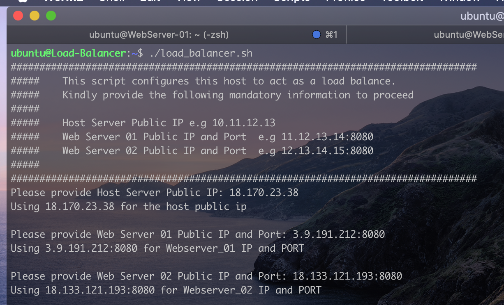
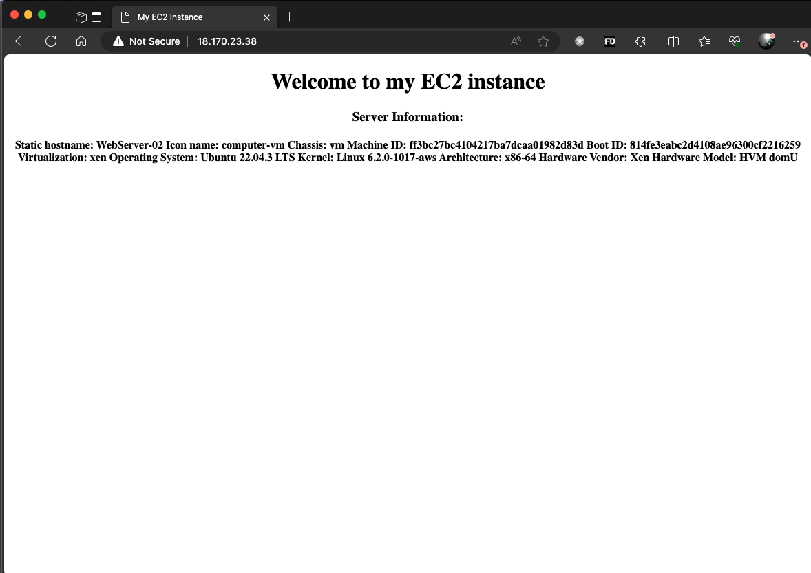
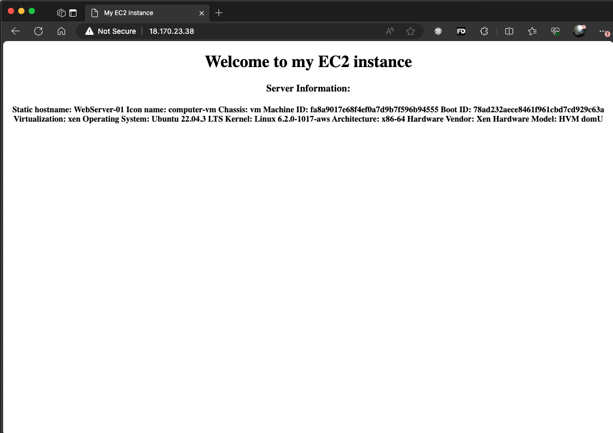

# Automating the configuration of a Load Balancer in Nginx using Shell Script

In the previous project [Designing a Load Balancer using Nginx](https://github.com/iamYole/DIO-Projects/tree/main/Project%207%20-%20Designing%20a%20Load%20Balancer%20using%20Nginx%20), we went throug the steps of configuring three (3) Linux Ubuntu system, two (2) activing as application servers, and one (1) a load balancer. The process was very manual, writing commands and editing text files.

We will be implementing the excat same thing in this project, but with the help of a bash scrit which can be reused over and over again.

### Part 1 - Bash Sctipt for the Backend Web Servers Automation.

The script below contains all the commands required to get our webservers up and running. Open your favorite text editor copy and paste the script below into a text file, then save it as `webapp.sh`

> ```bash
> #! /bin/bash
>
> ######################################################################################################################
> ##### This automates the deployment of a Web Application running on Apache Web Server.
> ##### Usage: The script is designed to run on a Linux Debian Distribution.
> ##### It was designed using Ubuntu 22.04.3 TLC
> #####
> ##### An example of how to call the script is shown below:
> ##### ./webapp.sh
> #############################################################################################################
>
>
> #set -x # debug mode
> set -e # exit the script if there is an error
> set -o pipefail # exit the script when there is a pipe failure
>
> sudo apt update -y
>
> echo "#################################################################################"
> echo "                     INSTALLING APACHE WEB SERVER                                 "
> echo "#################################################################################"
> echo " "
> sudo apt install apache2 -y
> echo " "
> echo "#################################################################################"
> echo "                     APACHE WEB SERVER INSTALLED SUCESSFULLY                      "
> echo "#################################################################################"
> echo " "
> sudo systemctl status apache2
>
> # Configure Apache to run on port 8080 instead of the default port 80.
> sudo sed -i 's/Listen 80/Listen 8080/' /etc/apache2/ports.conf
>
> sudo systemctl stop apache2
>
> # Configure the defual Virtual Host to also run on port 8080.
> sudo sed -i 's/<VirtualHost *:80>/<VirtualHost *:8080>/' /etc/apache2/sites-available/000-default.conf
> #sudo vim -c 's%/<VirtualHost *:80>/<VirtualHost *:8080>/g' -c "wq!" /etc/apache2/sites-available/000-default.conf
>
> echo " "
> echo "#################################################################################"
> echo "                         CREATING THE INDEX.HTML                                 "
> echo "#################################################################################"
> echo " "
>
> # Define the content for the index.html file
> server_info=$(hostnamectl)
> html_content=$(cat <<EOF
> <!DOCTYPE html>
> <html>
>  <head>
>    <title>My EC2 Instance</title>
>  </head>
>  <body>
>    <center>
>      <h1>Welcome to my EC2 instance</h1>
>      <h3>Server Information: </h3>
>       <h4>${server_info}</h4>
>    </center>
>  </body>
> </html>
> EOF
> )
> # delete the exiting index.html
> #cd /var/www/html/
> #sudo rm index.html
>
> #Write the content to index.html
> echo "$html_content" > index.html
> sudo mv index.html /var/www/html/
>
> echo " "
> echo "#################################################################################"
> echo "                        INDEX.HTML CREATED SUCESSFULLY                           "
> echo "#################################################################################"
> echo " "
> echo "Restarting the apache server ......................."
> sudo systemctl start apache2
> sudo systemctl status apache2
>
> echo ""
> echo "#################################################################################"
> echo "                        ALL COMMANDS EXECUTED SUCESSFULLY                        "
> echo "#################################################################################"
>
> ```



If all goes well we should see the output in the image above.

> Remember to give the file execute permission by running the code below  
> `chmod +x webapp.sh`

Screenshot of` WebServer-01`


Screenshot of `WebServer-02`


### Part 2 - Bash Script for the Nginx Load Balancer

The script below contains all the commands required to get our loadbalancer up and running. Open your favorite text editor copy and paste the script below into a text file, then save it as `loadbalancer_script.sh`

> ```bash
> #!/bin/bash
>
> ############################################################################################################
> ##### This automates the configuration of Nginx to act as a load balancer
> ##### Usage: This script is interactive, and requires 3 variables.
> ##### The public IP of the EC2 instance where Nginx is installed
> ##### The webserver urls for which the load balancer distributes traffic.
> #############################################################################################################
>
> echo "#################################################################################"
> echo "##### This script configures this host to act as a load balance. "
> echo "##### Kindly provide the following mandatory information to proceed "
> echo "##### "
> echo "##### Host Server Public IP e.g 10.11.12.13 "
> echo "##### Web Server 01 Public IP and Port e.g 11.12.13.14:8080 "
> echo "##### Web Server 02 Public IP and Port e.g 12.13.14.15:8080 "
> echo "##### "
> echo "#################################################################################"
>
> #set -x # debug mode
> set -e # exit the script if there is an error
> set -o pipefail # exit the script when there is a pipe failure
>
> read -p "Please provide Host Server Public IP: " PUBLIC_IP
>   if [ -z "${PUBLIC_IP}" ]; then
>       echo "Please provide Host Server Public IP"
>       exit 1
>   fi
> echo "Using $PUBLIC_IP for the host public ip"18
> echo " "
>
> read -p "Please provide Web Server 01 Public IP and Port: " WEBSERVER01
>   if [ -z "${WEBSERVER01}" ]; then
>       echo "Please provide Web Server 01 Public IP and Port:"
>       exit 1
>   fi
> echo "Using $WEBSERVER01 for Webserver_01 IP and PORT"
> echo " "
>
> read -p "Please provide Web Server 02 Public IP and Port: " WEBSERVER02
>   if [ -z "${WEBSERVER02}" ];then
>       echo "Please provide Web Server 02 Public IP and Port:"
>       exit 1
>   fi
> echo "Using $WEBSERVER02 for Webserver_02 IP and PORT"
> echo " "
>
> sudo apt update -y
> echo "#################################################################################"
> echo " All set. Installing Nginx "
> echo "#################################################################################"
> sudo apt install nginx -y
> echo " "
> echo "#################################################################################"
> echo " NGINX WEB SERVER INSTALLED SUCESSFULLY "
> echo "#################################################################################"
> echo " "
> sudo systemctl status nginx
>
> echo " "
> echo "Configuring the load balancer ........"
>
> sudo touch /etc/nginx/conf.d/loadbalancer.conf
>
> sudo chmod 644 /etc/nginx/conf.d/loadbalancer.conf
> sudo chmod 644 -R /etc/nginx/
>
> loadbalancer_content=$(cat <<EOF
> upstream backend_servers { # your are to replace the public IP and Port to that of your webservers
>
>    server  ${WEBSERVER01}; # public IP and port for webserser 1
>    server ${WEBSERVER02}; # public IP and port for webserver 2
>    }
>
>    server {
>        listen 80;
>        server_name ${PUBLIC_IP};
>
>        location / {
>            proxy_pass http://backend_servers;
>            #proxy_set_header Host $PUBLIC_IP;
>            #proxy_set_header X-Real-IP $remote_addr;
>            #proxy_set_header X-Forwarded-For $proxy_add_x_forwarded_for;
>        }
>    }
>
> EOF
> )
>
> # Write the content to loadbalancer.conf
>
> sudo bash -c "echo '$loadbalancer_content' > /etc/nginx/conf.d/loadbalancer.conf"
>
> sudo nginx -t
> echo "#################################################################################"
> echo " Nginx files configured sucessfully "
> echo "#################################################################################"
> echo " "
> echo "Resarting the server .............."
> sudo systemctl restart nginx
> echo " "
> sudo systemctl status nginx
> echo " "
> echo "#################################################################################"
> echo "##### Load Balancer up and running "
> echo "##### To access your applications, visit http://$PUBLIC_IP "
> echo "#################################################################################"
>
> ```

    Save the file and make it executable by running the code below
    `chmod +x loadbalancer.sh`
    Run the script and provide the variables below:

    Note: Please provide the ip addresses of your own servers


Screenshot of the interactive script requesting for the server details


If all works well, you should see the sucessful message above


Screenshot of the loadbalancer redirecting the client to `WebServer-02`.


Refresh the page and it should direct you to `WebServer-01` based on the loadbalancer's round-robin algorithm

    Please note the ip is the load balancer's public IP and not that of the webservers.
    In ideal situations, we can configure the web servers to only accept traffic from the load balancer.

**There you have it. With just two reusable bash scripts, we've deployed two(2) web applications and configured a load balance to evenly distribute traffic between the web application servers**
